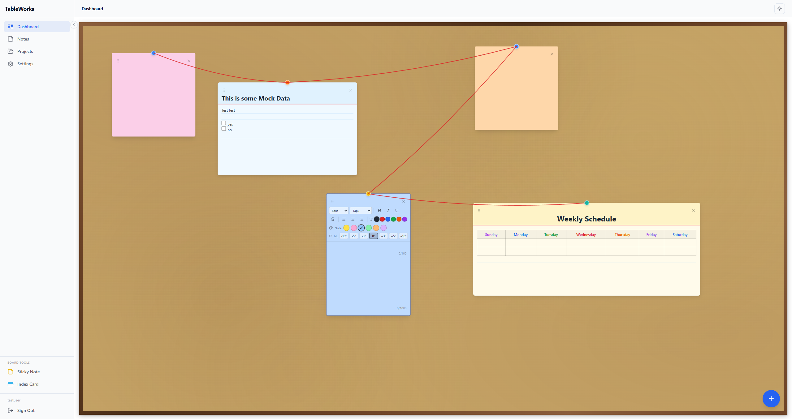

# TableWorks

A productivity web application featuring a visual cork board dashboard where users can create sticky notes, index cards, and connect ideas with red string links -- all in a rich, interactive workspace.



---

## Table of Contents

- [Overview](#overview)
- [Features](#features)
- [Technology Stack](#technology-stack)
- [Project Structure](#project-structure)
- [Getting Started](#getting-started)
- [Architecture](#architecture)
- [API Endpoints](#api-endpoints)
- [CI/CD](#cicd)
- [Infrastructure](#infrastructure)
- [Documentation](#documentation)
- [Future Plans](#future-plans)

---

## Overview

TableWorks is a web-based productivity platform that combines note-taking, project planning, and visual organization on an interactive cork board. Users can drag sticky notes and index cards around a realistic board, connect related ideas with red string links (detective-board style), and format content with a full rich text editor including tables and checklists.

The application is built with a clean-architecture ASP.NET Core 8 backend and a React + TypeScript frontend, backed by PostgreSQL.

---

## Features

### Cork Board Dashboard

- Realistic cork board with wood-grain border and textured surface
- Drag items from the sidebar or use the floating add button
- Click any item to bring it to the front (z-index stacking)
- Light and dark mode support

### Sticky Notes

- Drag and drop positioning on the board
- 8-direction resize (120px min, 600px max)
- Rich text editing with TipTap (bold, italic, underline, strikethrough)
- Font family (Sans, Serif, Mono, Cursive) and font size (8--48px)
- Text color and text alignment (left, center, right)
- 6 color themes: Yellow, Pink, Blue, Green, Orange, Purple
- Rotation/tilt presets (-10 to +10 degrees)
- Character limits with counters (title: 100, content: 1,000)
- Delete confirmation for notes with content

### Index Cards

- Larger format (450x300 default, up to 800x600)
- Ruled lines that adapt to text size (like real index cards)
- Colored header band with red rule separator
- All sticky note features plus:
  - Table creation and editing (add/remove rows and columns)
  - Checklists / task lists with interactive checkboxes
  - Bullet and ordered lists
  - Horizontal dividers
- 6 distinct colors: White, Ivory, Sky, Rose, Mint, Lavender
- Higher content limit (10,000 characters)

### Red String Connections

- Click and drag between pins to link any two items
- Catenary (hanging string) curves rendered in SVG at 60fps
- Works between notes, cards, or across both types
- Hover to highlight; click to delete

### Sidebar Board Tools

- Drag a Sticky Note or Index Card icon from the sidebar onto the board
- Click the icon to create at a random position
- Collapsible sidebar with responsive icon/label layout

### Authentication

- JWT-based login and registration
- Refresh token rotation
- Protected routes with automatic redirect
- Persistent sessions via localStorage

### Theme System

- Light, dark, and system-preference modes
- CSS variable-based theming
- Instant switching with persistence

---

## Technology Stack

### Frontend

| Technology          | Purpose                              |
|---------------------|--------------------------------------|
| React 18            | UI framework                         |
| TypeScript          | Type safety                          |
| Vite                | Build tool and dev server            |
| React Router DOM    | Client-side routing                  |
| Tailwind CSS        | Utility-first styling                |
| TipTap (ProseMirror)| Rich text editing                    |
| react-draggable     | Drag and drop positioning            |
| Axios               | HTTP client with auth interceptors   |
| Lucide React        | Icon library                         |

### Backend

| Technology          | Purpose                              |
|---------------------|--------------------------------------|
| ASP.NET Core 8      | Web API framework                    |
| Entity Framework Core 8 | ORM and migrations               |
| PostgreSQL 16       | Relational database                  |
| FluentValidation    | Request validation                   |
| AutoMapper          | Object mapping                       |
| Serilog             | Structured logging                   |
| JWT Bearer          | Authentication                       |
| Swagger / OpenAPI   | API documentation                    |

### Infrastructure

| Technology          | Purpose                              |
|---------------------|--------------------------------------|
| Docker Compose      | Local development environment        |
| GitHub Actions      | CI/CD pipeline                       |
| Terraform (planned) | Infrastructure as Code               |

---

## Project Structure

```
TableWorks/
├── .github/workflows/          # CI/CD pipelines
│   └── backend-ci.yml
├── Docs/
│   ├── Images/                 # Screenshots and diagrams
│   ├── Implementations/        # Feature implementation summaries
│   └── Planning/               # Project proposal and requirements
├── infra/
│   └── environments/           # Terraform env configs (dev, staging, prod)
├── Source/
│   ├── backend/
│   │   ├── src/
│   │   │   ├── TableWorks.API/           # Controllers, middleware, startup
│   │   │   ├── TableWorks.Application/   # Services, DTOs, validators
│   │   │   ├── TableWorks.Core/          # Entities, enums, interfaces
│   │   │   └── TableWorks.Infrastructure/# DbContext, repos, migrations
│   │   ├── tests/
│   │   │   └── TableWorks.Tests/         # Unit and integration tests
│   │   ├── docker-compose.yml
│   │   └── TableWorks.sln
│   └── frontend/
│       ├── src/
│       │   ├── api/              # API client functions
│       │   ├── components/       # React components
│       │   │   ├── auth/         # ProtectedRoute
│       │   │   ├── dashboard/    # CorkBoard, StickyNote, IndexCard, etc.
│       │   │   └── layout/       # AppLayout, Sidebar, Navbar
│       │   ├── context/          # Auth and Theme providers
│       │   ├── lib/              # TipTap custom extensions
│       │   ├── pages/            # Page components
│       │   ├── router/           # Route configuration
│       │   └── types/            # TypeScript interfaces
│       ├── package.json
│       └── vite.config.ts
└── README.md
```

---

## Getting Started

### Prerequisites

- [.NET 8 SDK](https://dotnet.microsoft.com/download/dotnet/8.0)
- [Node.js 18+](https://nodejs.org/)
- [Docker](https://www.docker.com/) (for PostgreSQL)

### Backend

```bash
cd Source/backend

# Copy environment config
cp .env.example .env

# Start PostgreSQL via Docker
docker compose up -d

# Apply database migrations
dotnet ef database update --project src/TableWorks.Infrastructure --startup-project src/TableWorks.API

# Run the API (default: http://localhost:5000)
dotnet run --project src/TableWorks.API/TableWorks.API.csproj
```

### Frontend

```bash
cd Source/frontend

# Install dependencies
npm install

# Start the dev server (default: http://localhost:5173)
npm run dev
```

The frontend dev server proxies `/api` requests to `http://localhost:5000`.

---

## Architecture

The backend follows **clean architecture** with four layers:

```
API Layer (Controllers, Middleware)
    ↓
Application Layer (Services, DTOs, Validators, Mappings)
    ↓
Core Layer (Entities, Enums, Interfaces)
    ↓
Infrastructure Layer (DbContext, Repositories, Migrations)
```

### Key Entities

| Entity         | Description                                      |
|----------------|--------------------------------------------------|
| User           | Authentication, preferences, roles               |
| Note           | Core content with position, size, color, rotation |
| Project        | Collaborative projects with members              |
| Tag / NoteTag  | Categorization (many-to-many)                    |
| Folder         | Hierarchical organization                        |
| Notification   | User notifications                               |
| AuditLog       | Activity tracking                                |
| RefreshToken   | JWT refresh token storage                        |

### Frontend State Management

- **React Context API** for global state (auth, theme)
- **Component-level useState** for UI state
- **Optimistic updates** with background API persistence
- **No global store library** -- state is co-located with the components that use it

---

## API Endpoints

| Area           | Endpoints                                         |
|----------------|---------------------------------------------------|
| Auth           | `POST /auth/login`, `/register`, `/refresh`       |
| Notes          | `GET/POST /notes`, `GET/PATCH/DELETE /notes/:id`  |
| Index Cards    | `GET/POST /index-cards`, `PATCH/DELETE /index-cards/:id` |
| Projects       | `GET/POST /projects`, `GET/PUT/DELETE /projects/:id` |
| Folders        | `GET/POST /folders`, `GET/PUT/DELETE /folders/:id` |
| Tags           | `GET/POST /tags`, `GET/PUT/DELETE /tags/:id`      |
| Notifications  | `GET /notifications`, `PATCH /notifications/:id`  |
| Admin          | `GET /admin/users`, `GET /admin/notes`            |
| Health         | `GET /health`                                     |

Full API documentation is available via Swagger at `/swagger` when the backend is running.

---

## CI/CD

### Backend CI (GitHub Actions)

Triggers on push or pull request to `main` affecting `Source/Backend/**`:

1. Sets up .NET 8.0.x SDK
2. Starts a PostgreSQL 16 service container
3. Restores NuGet dependencies
4. Builds the solution
5. Installs EF Core tools
6. Validates and applies database migrations
7. Runs tests

---

## Infrastructure

### Local Development

Docker Compose provides PostgreSQL 16 with health checks and an optional pgAdmin instance (via Docker profile).

### Deployment (Planned)

The `infra/` directory contains a Terraform scaffold with environment configurations for dev, staging, and production. Modules for database provisioning and networking are planned but not yet implemented.

| Environment | Config File                    |
|-------------|--------------------------------|
| Development | `infra/environments/dev.tfvars`     |
| Staging     | `infra/environments/staging.tfvars` |
| Production  | `infra/environments/prod.tfvars`    |

---

## Documentation

Detailed implementation documentation is available in the `Docs/` directory:

| Document | Description |
|----------|-------------|
| [Project Proposal](Docs/Planning/ProjectProposal.md) | Architecture, data model, API design, UI/UX principles |
| [Project Requirements](Docs/Planning/ProjectRequirements.md) | User stories, functional and non-functional requirements |
| [Dashboard Implementation](Docs/Implementations/DashboardImplementationSummary.md) | Cork board, sticky notes, drag/resize, rich text editing |
| [Red String Implementation](Docs/Implementations/RedStringImplementationSummary.md) | Visual connections between notes with SVG rendering |
| [Index Card Implementation](Docs/Implementations/IndexCardImplementaionSummary.md) | Index cards with tables, checklists, ruled lines, sidebar tools |

---

## Future Plans

- Desktop application (Electron or Tauri)
- iOS mobile application
- Backend endpoints for Index Cards
- Real-time collaboration on projects
- Note table view with sorting and filtering
- Calendar and timeline views for projects
- Full-text search across notes
- Cloud infrastructure deployment via Terraform
